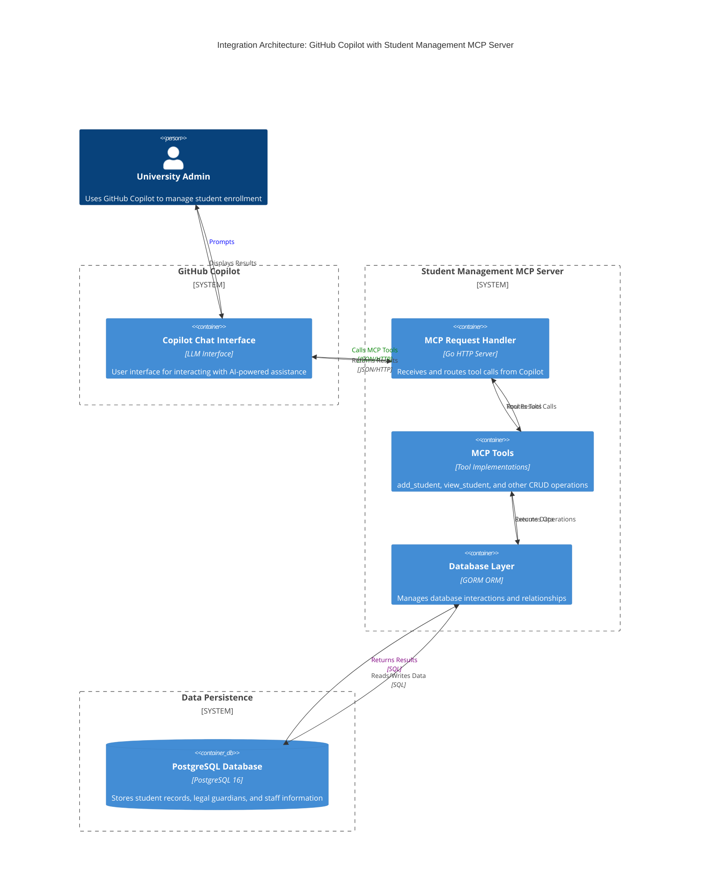

# go-mcp-student-mgmt
Majority of our applications do one basic thing which is writing into a database, and reading from the database which is followed by usually some sort of decision making and a subsequent database write. For this we build APIs and UI to interact with those API. But what if the new age of software engineering is basically doing the same thing but assisted with some sort of LLM model like a Chatbot. 

Think of a university Admin is asking an AI Chatbot to enroll a number of students by just a prompt and copy pasting the student's information as plain text into the Chat but in the Backend the LLM will need to use MCP servers such as this project to complete the operation. So this project is an example of how that can happen. The same use case can be extended to achieve more complex applications.

## Architecture
For this project I used github Copilot to integrate with the Application.

### Copilot Integration with MCP Server



### Available Tools

The MCP Server exposes the following tools to Copilot:

- **add_student**: Create a new student record with name, email, and legal guardian information
- **view_student**: View list of all students and their legal guardians currently in the database

### Data Flow Example: Adding a Student

1. **User Prompt**: Admin says to Copilot: "Enroll a new student named John Doe with email john@university.edu and his legal guardian is Jane Doe"
2. **Copilot Processing**: Copilot understands the request and calls the `add_student` MCP tool with the provided information
3. **MCP Server Processing**: The server receives the tool call, validates the input, and creates the student record in PostgreSQL
4. **Response**: Results are returned to Copilot and displayed to the admin
5. **Using View Tool**: Admin can then ask Copilot to "show me all students in the system" which triggers the `view_student` tool
6. **MCP Server Processing**: The server receives the tool call, and returns the students list as text
7. **Response from Copilot**: Copilot shows the list of students as plain text.

## How to run this in local:

### Prerequisites

- **Docker** (v20.10+) - [Install Docker](https://docs.docker.com/get-docker/)
- **Docker Compose** (v1.29+) - [Install Docker Compose](https://docs.docker.com/compose/install/)
- **Git** - For cloning the repository

### Step 1: Clone the Repository

```bash
git clone https://github.com/darshan-bhattacharyya/go-mcp-student-mgmt.git
cd go-mcp-student-mgmt
```

### Step 2: Set Up Environment Variables

Copy the example environment file to create your local configuration:

```bash
cp .env.example .env
```

You can customize the environment variables in `.env` if needed:


### Step 3: Build and Run with Docker Compose

Start the application with all dependencies:

```bash
docker compose up -d --build
```

**What this does:**
- Builds the Go application using the Dockerfile
- Starts PostgreSQL database container
- Starts the MCP Server application container
- Creates a shared network between services
- Initializes the database with tables

### Step 4: Verify the Services are Running

Check if all containers are up and healthy:

```bash
docker compose ps
```

You should see:
- `student-mgmt-postgres` - PostgreSQL database (running)
- `student-mgmt-app` - Go MCP Server (running)


### Test the MCP Server

The MCP Server is now running on `http://localhost:8081` and can be accessed by GitHub Copilot through the MCP configuration. Or you can simply test the MCP server from Postman by creating a new MCP request and adding `http://localhost:8081` in the URL

#### Available Operations:

**Adding a Student:**
```
POST http://localhost:8081
Tool: add_student
```

**Viewing All Students:**
```
POST http://localhost:8081
Tool: view_student
```

### Useful Docker Commands

**Stop the application:**
```bash
docker compose down
```

**Stop and remove volumes (clears database):**
```bash
docker compose down -v
```
